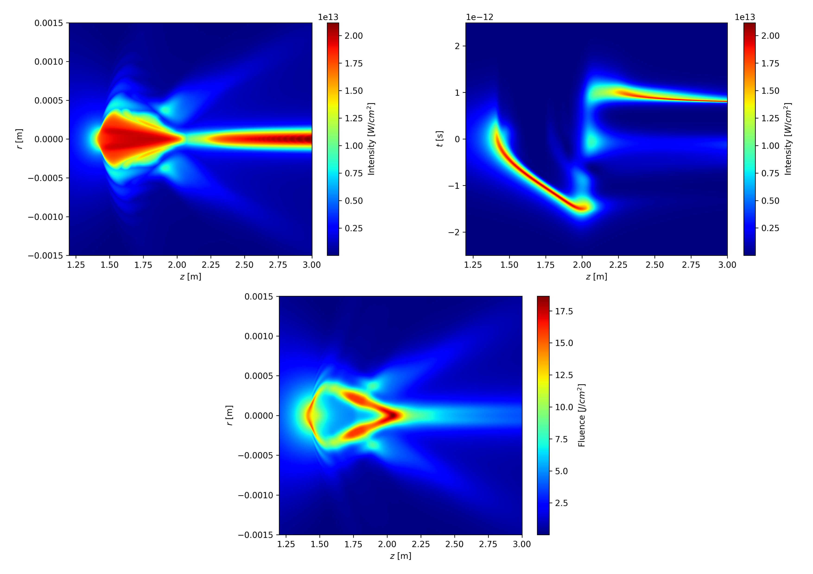

# Walkthrough
This section highlights the capabilities of the Acherus package and provides practical guidance, including comments on the input parameters required to run a simulation.

```{note}
Since Acherus was developed for future atmospheric lasing studies, the example images used throughout this guide focuses on **infrared picosecond laser filamentation in air**, a canonical case for filament-initiated nitrogen lasers.
```

The guide offers a detailed, step-by-step walkthrough on configuring the input parameters and accessing or visualizing the computed laser and filament data.

## Configuration file
The `acherus` package uses a simple configuration or parameter file to provide every single piece of information needed before, during, and after running each simulation. This simple approach is aligned with most numerical computing projects written in compiled languages, such as C, C++, and Fortran; whereas most Python packages require the user to generate their own script, import third-party libraries or modules, and import package-specific classes or modules that will allow to run the simulation. Once these external tools are imported, the user is further asked to provide them with suitable data variables, which are usually obtained by inserting inside the script additional lines of code. One major advantage of the configuration file is it removes this procedure entirely, leaving imports and preliminary computations to the package internal engine. In `acherus`, the user provides a collection of inputs, runs the process, and obtains a collection of outputs.

The configuration file structure---from now on until the end of this section will be named `example.toml`---consists of different `<key>=<value>` pairs under several sections or "headers" which divide the file in chunks. Each section name is surrounded by squared braces `[<section_name>]` and comments using the `#` symbol are ignored. Here is an example:

```toml
[medium_parameters.water] # This is a section or header for the `water` option
# The lines below are <key>-<value> option pairs given by the user
nonlinear_index = 4.1e-20
energy_gap = 6.5
collision_time = 1e-15
neutral_density = 6.7e28
initial_density = 1e9
```

As mentioned before, `example.toml` determines every aspect regarding the simulation. This implies some sections and `<key>-<value>` pairs are optional, depending on the nature of the problem. When the section header is `<section_name>.<option>`, the user must choose one valid `<option>` string from the set of available choices. Let's introduce the various options `acherus` package can receive from `example.toml` as input parameters.

```{note}
Keep in mind the order in which different section headers and option pairs are given is irrelevant inside the configuration file. The user is required to provide existing names for sections and their respective option pairs, but neither word order nor letter format come into consideration here. Unless explicitly stated, units used follow the Internal System of Units (SI).
```

### Output paths
The `example.toml` file admits two output paths key options. They are denoted by `data_output_path` and `figure_output_path` for storage of simulation data/figures while/after program execution. The user must provide one string for each value pointing to the exact path where data/figures will be saved. An example would be:

```toml
# Example of output paths for simulations results relative to the working directory
data_output_path = "./results/example_data" # example_data/ folder contains the data outputs
figure_output_path = "./results/example_figures" # example_figures/ contains the data figures
```

Since both the data and figure path parameters are optional, the user may omit them or comment out their corresponding keys. In that case, `acherus` saves data outputs by default in the working directory under the folder `results/`, and the figure outputs under `results/figures`. In general, the default figure output path is `<data_output_path>/figures`, where `<data_output_path>` might be either the default string `results` or another path specified by the user.

The data files are stored in `.h5` format with high compression settings using the [h5py](https://www.h5py.org) library, while the figures are lightweight `.png` files generated with [Matplotlib](https://matplotlib.org).

```{note}
Even for (2+1)-dimensional simulations, the output data files size stored inside the chosen folder can be quite large (a few gigabytes) for some laser filamentation problems. Most modern machines and personal laptops have plenty of disk space to store them, but it is recommended to provide a relative path outside the working or home directories to store the files for disk-intensive data outputs.
```

### Execution backends and numerical frameworks
For now, `acherus` only supports CPU execution as a backend, but we plan to provide GPU-acceleration in the future using the [NVIDIA CUDA Toolkit](https://docs.nvidia.com/cuda/index.html#) together with the [CuPy](https://cupy.dev) NumPy/SciPy-friendly library. On the other hand, two numerical frameworks can be used when computing laser propagation: a split-step Crank-Nicolson method applied to uncoupled time slices of the pulse (i.e., space-time phenomena are neglected), and a Fourier frequency decomposition for time slices, coupled with a Crank-Nicolson method for the spatial components acting on each slice.

```{hint}
We will not provide further details about the mathematical techniques employed, as they are covered in the {ref}`Methods <methods>` section. It suffices to say that the latter approach is more powerful and general because---just to give a preview---it allows the simulation of effects such as space-time focusing and self-steepening, which involve "mixing" spatial and temporal coordinates. Any realistic filamentation study should take these effects into account.
```

Returning to the `example.toml` file, the backend option is specified by the key `computing_backend`, and the propagation technique is selected using the key `propagation_solver`. The available values correspond to the two numerical frameworks: the split-step Crank-Nicolson solver, denoted by `SSCN`, and the Fourier-Crank-Nicolson solver, denoted by `FCN`. These are shown below:

```toml
propagation_solver = "FCN"   # "FCN" | "SSCN"
computing_backend = "CPU"    # "CPU" | "GPU" (not supported yet!)
```

### Computational domain
Since `acherus` simulates laser beam propagation in free space using a rectangular grid of discrete points (or nodes), the numerical domain containing the electromagnetic wave packet and the medium stores values at these nodes in both space and time. This discretization corresponds to a finite-difference scheme---see the {ref}`Methods <methods>` section for details.

#### Mesh
Hence, withing the scope of `example.toml`, the user must specify the basic parameters that define the discretization of the radial, axial and temporal domains using the sections `[medium_parameters.<option>]`, where `<option>` refers to the three discretized dimensions of the grid: `space` for the radial/transverse coordinate (denoted by *r*), `axis` for the axial/longitudinal coordinate (denoted by *z*), and `time` for the temporal coordinate (denoted by *t*). Each dimension is uniquely defined by the number of nodes and the pair of initial and final coordinates.

An example of the complete set of input parameters is shown below:
```toml
# Example of mesh discretization options
# Recall that physical magnitudes use SI units, unless otherwise stated
[grid_parameters.space] # Radial mesh section
nodes = 15001 # Number of radial nodes
space_min = 0.0 # Initial radial coordinate
space_max = 15e-3 # Final radial coordinate

[grid_parameters.axis] # Axial mesh section
nodes = 6001 # Number of propagation nodes
axis_min = 0.0 # Initial propagation coordinate
axis_max = 3.0 # Final propagation coordinate
snapshots = 5 # Number of saved propagation slices

[grid_parameters.time] # Temporal mesh section
nodes = 512 # Number of time nodes
time_min = -6e-12 # Initial time coordinate
time_max = 6e-12 # Final time coordinate
```

Note that the initial radial and axial coordinates must always be set to zero, and non-negative values must be used for their final coordinates. This is because a cylindrically symmetric coordinate system is enforced, and the initial laser pulse (or "driver" beam) begins propagating at the *z*-origin (set to zero), where the entrance to the medium is assumed to be located.

The user must assign an integer value to the `snapshots` key to record full radial and temporal simulation data at evenly spaced positions along the axial coordinates.

```{note}
The pulse propagation equation used in `acherus`  ---see the {ref}`Physics <physics>` section for a detailed account---belongs to the class of ***z-propagated*** equations. In practice, this means the user must decide how many "frozen" states of the simulation along the axial direction to store for later analysis and visualization. For example, setting `snapshots = 5` will save simulation data (e.g., for plasma electron density) at six equally spaced *z*-slices, including the initial state.
```

Naturally, the number of grid points strongly affects both the simulation runtime and the memory requirements. For best performance, the number of time `nodes` should be chosen as a power of two (e.g., 256, 512, 1024, ...), since the FFT algorithm used to decompose the laser wave packet into frequency modes is more efficient in such cases. The stronger the nonlinear interaction expected between the pulse and the medium during propagation, the more grid points will be necessary to resolve fine spatiotemporal details. Consequently, both execution time and memory requirements will increase further.

```{tip}
An important remark regarding the radial and temporal final coordinates is that they must be chosen large enough to ensure that the laser electric field envelope decays to zero near the boundaries, thereby avoiding artificial reflections caused by boundary conditions. A practical rule of thumb is to choose the radial length to be **five times** the **initial beam waist** of the pulse, and the temporal window size **ten times** the initial **pulse duration**. Ultimately, the domain size and the grid resolution are closely tied to each specific scenario, and should be carefully tested multiple times.
```

#### Perfectly Matched Layer
In some cases, adding boundary layers near the domain edges---where the fields are expected to vanish---is important to minimize reflections at the boundaries of the numerical domain. These artifacts can be difficult (and computationally expensive) to mitigate simply by enlarging the simulation domain. The `example.toml` includes an optional ***Perfectly Matched Layer*** (PML) applied to the radial coordinates. The layer is designed to *attenuate* the laser's electric field as it enters the PML without introducing *artificial reflections* at the interface between the "physical" region and the PML, ideally reducing the reflection coefficient at the boundary of the computational domain to zero.

Fortunately, this type of boundary layers has been shown to work quite well for laser filamentation and beam propagation simulations. A detailed account is provided in the {ref}`Methods <methods>` section, following the approaches of [Zheng *et al*.](https://www.sciencedirect.com/science/article/pii/S0021999107003464) and [Antoine *et al*](https://doi.org/10.1134/S1054660X11150011). As a brief preview, an absorbing parabolic (quadratic) profile is used; it is continuous at the interface between the PML and the physical region and increases from zero up to a maximum absorption value.

If the user wishes to implement a PML layer, the keys for the absorption factor `pml_damping` and the PML thickness `pml_width` must be given two positive non-negative values. The `pml_width` parameter should be given as the ratio of the PML thickness to the total radial domain length, which consists of the physical domain (where the propagation equation remains unchanged) plus the PML layer. For example, if the total radial domain length is set to `space_max = 10e-3` (in meters) and the PML thickness is chosen to be 10% of computational domain, setting `pml_width = 0.1` yields a physical domain of `9e-3` and a PML thickness of `1e-3` for the radial grid.

```toml
# Example of PML
[grid_parameters.pml]
pml_damping = 10.0  # PML maximum damping coefficient (has no units)
pml_width = 0.1     # PML thickness (has no units)
```

### Medium properties
The medium plays a central role in filamentation problems because it directly affects the balance between the competing physical mechanisms that reshape the spatiotemporal profile of the laser pulse during propagation. In particular, it determines how the beam self-focuses, defocuses, and loses energy during propagation. Even seemingly small changes in some of these parameters can lead to significantly different outcomes, making their accurate specification essential for reliable simulations.

#### Basic settings
To set the basic medium parameters in `example.toml`, the section header `[grid_parameters.<option>]` is used. Here, `<option>` must be a string from the set of transparent media names included in `acherus`: `air`, `water`, and `silica` (more could be added in the future). The medium choice does not affect the internal behavior of the `<key>-<value>` pairs within the section, but rather the {ref}`dispersion <dispersion>` and strong field {ref}`ionization <ionization>` models employed for light-matter interactions. Here is the complete set of options available, normally used for air lasing:

```toml
# Example of air properties
[medium_parameters.AIR]
nonlinear_index = 3.0e-23   # Kerr index
energy_gap = 12.063         # ionization energy (in eV)
collision_time = 3.5e-13    # electron collision time
neutral_density = 5.4e24    # medium neutral atom density
initial_density = 1e9       # initial electron density
# recombination_rate = 1e-20      # Optional: electron recombination rate (default: None)
raman_partition = 0.5             # Optional: partition parameter (default: None)
raman_response_time = 70e-15      # Optional: damping time (default: None)
raman_rotational_time = 62.5e-15  # Optional: fundamental time (default: None)
```

Details about where each different physical magnitude participates should be consulted in the {ref}`Physics <physics>` section. The `initial_desity` parameter key represents the initial electron density at `time_min` (it should be negligible compared with `neutral_density`), and its purpose is to avoid near-zero logarithmic representation issues by introducing a small background ionization in the neutral medium. The key option for the electron-ion recombination rate is optional, as are the options related to stimulated molecular Raman scattering during propagation. This allows the user to include them or not, depending on the nature of the problem. Furthermore, not including them reduces simulation runtime, mainly because it avoids solving the Raman-Kerr contribution at each propagation step.

```{hint}
Recombination time scales are considerably longer (nanoseconds) than electron momentum transfer (collision) times and photoionization time scales (femtoseconds) for ultrashort pulses. This means recombination events occurs on much longer time scales than those considered in the vast majority of laser filamentation cases. On the other hand, the delayed (molecular) response of water (which red-shifts the spectrum of the pulse) has not been observed yet.
```

(dispersion)=
#### Dispersion models
Chromatic dispersion and wave diffraction are the two linear effects governing laser filamentation. These effects dominate spatiotemporal regions of low beam intensity, where nonlinear interactions vanish, and modulate the balance between nonlinear processes elsewhere.

In `example.toml`, dispersion is configured via the `[dispersion.<option>]` section. Users can choose between modeling full chromatic dispersion using the `full` option or approximating it with a finite number of dispersive coefficients (from one to four) using the `partial` option.

```{danger}
Care should be taken with the wavelength validity ranges of the dispersion models. Ensure that all frequencies involved during propagation remain within the range of the empirical equations.
```

In the full-dispersion case, quantities such as the pulse wavenumber and linear refractive index are computed from the dispersion relation derived from the semi-empirical Sellmeier equation for each medium; no additional parameters are required. Air uses [Peck](https://opg.optica.org/josa/abstract.cfm?uri=josa-62-8-958), water uses [Mielenz](https://opg.optica.org/ao/abstract.cfm?uri=ao-17-18-2875), and silica uses [Malitson](https://opg.optica.org/josa/abstract.cfm?uri=josa-55-10-1205); these are the most common models for laser filamentation.

 In contrast, the truncated case requires the coefficients of the Taylor expansion of the dispersion relation around the central laser frequency, ranging from group velocity dispersion (GVD) to up to three higher-order chromatic terms. For further details, see the {ref}`Physics <physics>` section. Here are both scenarios:

```toml
# Example of full chromatic dispersion
[dispersion.full]

# Example of third order dispersion (in air for 800 nm)
[dispersion.partial]
k2 = 2e-28      # Required: 2nd order (GVD) dispersion coefficient
# k3 = 3e-43    # Optional: 3rd order dispersion coefficient
# k4 = 1e-58    # Optional: 4th order dispersion coefficient
# k5 = 5e-74    # Optional: 5th order dispersion coefficient
```

(ionization)=
#### Photoionization models
The medium chosen has an important influence on the strong-field interaction with the laser beam and on how it forms the filament. Intense laser fields can rapidly ionize the medium they traverse via a process known as photoionization (PI) or optical field ionization (OFI), which is a key nonlinear process during laser filamentation and the dominant mechanism for plasma generation, governing electron density evolution (ionization is dominated by the pulse duration time scales, and the shorter the pulse duration, the more it controls ionization over collisions and recombination).

Two models are currently implemented (tunnel ionization limit could be included in the future!): the **multiphoton ionization (MPI) limit** and the **general Keldysh theory**.

```{hint}
For example, air uses the [Perelomov, Popov, and Terent'Ev](https://jetp.ras.ru/cgi-bin/dn/e_023_05_0924.pdf) (PPT) theory with subsequent [Mishima](https://link.aps.org/doi/10.1103/PhysRevA.66.033401) contributions, while water and silica use the Keldysh theory for condensed dielectrics and solids. For the adventurous, check the original articles!
```

In `example.toml`, the models are configured via the `[ionization_model.<option>]` sections. Users can choose between:

* `keldysh` option. The general Keldysh theory of strong-field ionization. No parameters are required; optional parameters include a convergence parameter `tolerance` and a `max_iterations` threshold, which have default values set to ensure, in most cases, the series computation converges with good accuracy. A third optional parameter, `reduced_mass`, should be specified only for condensed/bulky materials; it represents, in electron mass units, the electron-hole reduced mass.
* `mpi` option. The multiphoton limit of the general Keldysh theory, which applies for lower peak intensities. The `cross_section` parameter, representing the multiphoton coefficient, is required.

In both cases, the ionization models in `acherus` use an interpolation object that maps pulse intensities to their corresponding ionization rates. Two additional optional parameters, `intensity_range` and `num_points`, can also be specified, representing the intensity range of the pulse and the number of interpolation points used in the interpolation table, respectively. For a quick overview of the physics, see the {ref}`Physics <physics>` section; for details about the construction of the interpolation table, see the {ref}`Methods <methods>` section.

```{danger}
Be aware the pulse intensities used in the interpolation table should be wide enough to include all physically relevant values, avoiding extrapolation far from the important spatiotemporal regions. The maximum intensity value usually does not pose a problem, since peak intensity values can be estimated beforehand for a given problem.
```

Here are both ionization `example.toml` settings:

```toml
# Example of general Keldysh model
[ionization_model.keldysh]
intensity_range = [1e-6, 1e18]  # Optional: interpolation interval (default: [1e-1, 1e18])
num_points = 200000             # Optional: interpolation grid size (default: 10000)
# tolerance = 1e-3              # Optional: series convergence tolerance (default: 1e-3)
# max_iterations = 250          # Optional: series max iterations (default: 250)
# reduced_mass = 0.5            # Optional: only for condensed or bulky media (such as water and silica)

# Example of MPI model (in air for 800 nm)
[ionization_model.mpi]
cross_section = 2.81e-128       # Required: Multiphoton ionization (MPI) coefficient
intensity_range = [1e-6, 1e18]  # Optional: interpolation interval (default: [1e-1, 1e18])
num_points = 200000             # Optional: interpolation grid size (default: 10000)
```

### Input beam
The initial laser pulse wavepacket, or *driver*, is defined in `example.toml` under the `[pulse_parameters.<option>]` section. The `gaussian` option is currently the only available spatiotemporal profile, although additional beam profiles---such as ring-Airy, Bessel, and Laguerre-Gauss---are planned for future releases.

The input beam plays a key role in filamentation, as it sets the initial optical properties of the wavepacket and influences how the balance between nonlinear processes evolves during propagation.

```{note}
The input conditions in the medium can enhance or diminish the propagation dynamics of the pulse. From beam collapse to pulse-splitting events and multiphoton absorption losses, all of these physical phenomena---including plasma generation and the spatial and temporal distribution of the filament---can be significantly influenced by the driver's shape, .
```

#### Gaussian beam
The `gaussian` option has four required `<key>-<value>` pairs that define the beam:

* `wavelength`: Central wavelength of the beam.
* `waist`: Beam waist, defined as the half-width at $1/e$ of the radial **envelope**.
* `duration`: Pulse duration, defined as the half-width at $1/e$ of the temporal **envelope**.
* `energy`: Total pulse energy.

Together, these parameters describe a flat-phase, standard Gaussian pulse (bell-shaped), which is the most common input used in laser filamentation simulations. This is because it resembles the (idealized) output of laboratory laser systems. Although it represents an ideal case, it provides a reliable starting point.

To include an initial phase---such as curved wavefronts from lens focusing or a temporal (quadratic) chirp---the user can use the optional parameters `focal_length` and `chirp`. A third optional key, `gauss_order`, allows the generation of super-Gaussian (flat-top) radial profiles, which can better mimic realistic laser sources with bright centers and dim edges. See the {ref}`Physics <physics>` section for more details on the available input beam models.

The `example.toml` input beam block looks like this:
```toml
# Example of regular lens-focused Gaussian picosecond pulse
[pulse_parameters.gaussian]
wavelength = 1032e-9  # Required
waist = 3.57e-3       # Required (half-width at 1/e or FWHM/sqrt(2*log(2)) waist)
duration = 1274e-15   # Required (half-width at 1/e or FWHM/sqrt(2*log(2)) duration)
energy = 0.1          # Required
focal_length = 2.0    # Optional (default: None)
# chirp = 0.890       # Optional (default: None)
# gauss_order = 3     # Optional (default: 2)
```

### Density solver
Temporal evolution of the electron density generated during propagation (see the {ref}`Physics <physics>` section) is computed for each radial coordinate using one of four available options in the `[density_solver.<options>]` section. The recommended options are three variable-step Runge-Kutta methods---`rk23`, `rk45`, and `dop853`---which rely on SciPy's function `solve_ivp`. These methods use different error-control algorithms to adapt the size of each time step. They have proven to be excellent for resolving plasma generation, and the user must specify the relative tolerance, `rtol`, and absolute tolerance, `atol`, to ensure that the relative error stays below the acceptable threshold. See SciPy's [documentation](https://docs.scipy.org/doc/scipy/reference/generated/scipy.integrate.solve_ivp.html#scipy.integrate.solve_ivp) for details on the algorithms and the meaning of the tolerance parameters.

It is important to understand that `atol` controls the number of correct decimal places, while `rtol` the number of correct significant digits. The solver attempts to keep the local error estimate below the total sum `atol + rtol * abs(y)` for every time step. The absolute tolerance only matters when the density is close to zero. In any realistic filamentation scenario, the density is strictly increasing---recombination processes slightly reduce free electron density, but their contribution to overall plasma dynamics is negligible.

```{tip}
In ultrashort filamentation, electron density values typically reach 10¹⁶–10¹⁷ cm⁻³ in gases and 10¹⁸–10¹⁹ cm⁻³ in condensed media. In such cases, the relative tolerance dominates the local error at every propagation step. For example, setting the initial electron density to 10⁹ cm⁻³ (typical for pure gases) effectively renders the absolute tolerance irrelevant.
```

Therefore, the electron density may approach its initial value but does not fall below it, nor does it approach zero.

The complete list of available options is given below:

```toml
# Example of density solver adaptive-step options
[density_solver.rk23]
rtol = 1e-9    # Optional (default: 1e-3)
# atol = 1e-6  # Optional (default: 1e-6)

[density_solver.rk45]
rtol = 1e-9    # Optional (default: 1e-3)
# atol = 1e-6  # Optional (default: 1e-6)

[density_solver.dop853]
rtol = 1e-9    # Optional (default: 1e-3)
# atol = 1e-6  # Optional (default: 1e-6)

# Example of density solver fixed-step option
[density_solver.rk4]
```

## Running a simulation
Once `acherus` is installed and the Python environment is ready (for example, by following the {ref}`Installation Guide <installation>` instructions), simulations can be executed directly from the command-line interface by passing the configuration file name (e.g., `example.toml`) to the package. Make sure the file is located in your working directory.

Alternatively, you can provide a relative or absolute path if the configuration file is located elsewhere.

Depending on how `acherus` was installed, use one of the following approaches:
::::{tab-set}

:::{tab-item} Installed
```text
acherus example.toml
```
or, to override the output data path:
```text
acherus example.toml --output ./results/output_data_path
```
:::

:::{tab-item} Cloned (module execution)
```text
python -m acherus example.toml
```
or, to override the output data path:
```text
python -m acherus example.toml --output ./results/output_data_path
```
:::

:::{tab-item} Cloned (editable mode)
```text
acherus example.toml
```
or, to override the output data path:
```
acherus example.toml --output ./results/output_data_path
```

:::

::::

```{tip}
A typical simulation may take from a few hours to days, depending on the spatial and temporal resolution needed. Running the process in the background is recommended so you can keep using the terminal.
```

By default, the simulation output data and figures are written to the directories defined in the configuration file. The optional `--output` argument allows you to override this location from the command-line.

## Monitoring a simulation
To monitor a simulation during runtime, use:
```text
acherus-monitoring --config example.toml
```
or, if running from the cloned repository:
```text
python -m acherus.monitoring --config example.toml
```
During runtime, the simulation writes to a file called `acherus_monitoring.h5`, which can be used to track the peak intensity evolution. The monitoring tool reads this file and saves the latest recorded propagation step of the pulse intensity. This is particularly useful for long runs, as it allows you to inspect intermediate results without waiting for completion.

## Displaying results
Once a simulation has finished, two additional files---`acherus_diagnostics.h5` and `acherus_snapshots.h5`---are saved in the data directory. These can be saved in the path pointing to the figures directory set by the user and visualized using the plotting tool:
```text
acherus-plotting --config example.toml --cli-options
```
or, if plotting from the cloned repository:
```text
python -m acherus-plotting --config example.toml --cli-options
```

The plotting tool can use the configuration file to locate input/output paths, or these can be overwritten by passing them as command-line arguments to the plotting tool parser.

### Plotting options
Any CLI arguments for the plotting tool can be used independently (unless stated otherwise). The following organization and examples are provided for clarity and completion purposes.
#### Path arguments
The path-related arguments for reading and writing input/output data are:
* `--config`: Path to the TOML configuration file. If defined, it uses the data and figure paths provided by the user.
* `--sim-path`: Path where data files are stored. Overrides the configuration file.
* `--fig-path`: Path where figures are saved. Overrides the configuration file.

```{tip}
It is recommended to define data and figure paths in the configuration file before running a simulation. Then, you only need to pass the configuration file (name and extension) to the plotting tool.
```

#### Variables and dimensions arguments
These arguments control what is plotted:
* `--variables`: Comma-separated list of physical quantities to plot (default: `intensity,density,fluence,radius`).
  Available options include:
  - `intensity`: Beam intensity (full space-time profiles, peak intensity, and on-axis intensity).
  - `density`: Electron density (full space-time profiles, peak density, and on-axis density).
  - `fluence`: Beam fluence distribution.
  - `radius`: Beam radius.

Example:
```text
acherus-plotting --variables intensity,density
```

* `--dimensions`: Comma-separated list of dimensions to plot (default: `1d,2d`).
Available options include:
* `1d`: One-dimensional plots (**line plots** over time or propagation distance).
* `2d`: Two dimensional plots (**color maps** over spatial and temporal coordinates).
* `3d`: Three-dimensional plots (**surface plots** over spatial and temporal coordinates).

Example:
```text
acherus-plotting --dimensions 1d,2d
```

#### Domain arguments
To restrict the region of the computational domain:
* `--radial-limit`: Maximum radial coordinate (default: full grid).
* `--axial-range`: Axial range as `min,max` tuple. Use `="min,max"` if values are negative (default: full grid).
* `--time-range`: Time range as `min,max` tuple. Use `="min,max"` if values are negative (default: full grid).
* `--scale`: Axis scaling. Options are:
  * `linear`: Use regular axis (default).
  * `log`: Use logarithmic axis.
  * `both`: Use both regular and logarithmic axes (one plot each).
* `--log-y-range`: logarithmic range as `min,max` tuple. Applies to: 
  * 1D semi-logarithmic plots with a logarithmic y-axis.
  * 2D semi-logarithmic plots with a logarithmic (colormap) y-axis.
  * 3D semi-logarithmic plots with a logarithmic z-axis. 
  Required when using `log` or `both`.
* `--log-rt-levels`: Number of contour levels for 2D semi-logarithmic (r,t) plots. Required when using `log` or `both`. For example, specifying four contour levels displays a logarithmic scale (in normalized units) from 10⁰ to 10⁻⁴ using the selected colormap, with values out of range shown in white.

One example would be:
```text
acherus-plotting --radial-limit 2e-3 --axial-range 1.2,2.2 --time-range="-1.5e-12,2.5e-12"
```

#### Visualization arguments
To control figure appearance:
* `--radial-symmetry`: Displays plots symmetrically around the radial axis. Accepts `true` or `false` (default: `false`).
* `--colors-1d`: Comma-separated triplet of RGB colors (`0-1`) for 1D plots (default: `0.121569,0.466667,0.705882`).
* `--colors-2d`: Matplotlib colormap name for 2D/3D plots (default: `jet`). See the [Matplotlib](https://matplotlib.org/stable/gallery/color/colormap_reference.html) colormap reference for the options available.
* `--dpi`: Figure resolution in dots per inch (default: `300`).
* `--camera-view`: Comma-separated triplet of viewing angles (`azimuth,elevation,altitude`) for 3D plots (default: `200,15,0`).

An example would be:
```text
acherus-plotting --dimension 1d,2d,3d --colors-1d 0.2,0.6,0.8 --colors-2d viridis --dpi 150 --camera-view 175,8,15 --radial-symmetry true
```

## Air filamentation example
To illustrate a few scenarios, four example [input `.toml` files](https://github.com/ismatorresgarcia/acherus/tree/master/examples) are provided in the 📁 `examples/` directory of the [GitHub](https://github.com/ismatorresgarcia/acherus) repository. These include femtosecond and picosecond filamentation in air at infrared wavelengths, as well as femtosecond filamentation in water at ultraviolet and infrared regimes. Each case shows distinctive nonlinear dynamics, and more examples are planned for future releases.

As a demonstration of the plotting tool's features, consider the picosecond air filamentation case, which reproduces the experimental and numerical results from [Houard *et al*](https://opg.optica.org/oe/abstract.cfm?uri=oe-24-7-7437). The corresponding configuration file is named `001_air_IR_ps.toml` and can be found inside the 📁 `examples/` folder.

To run the simulation process in the background (Linux or macOS), use:
```text
nohup acherus 001_air_IR_ps.toml &
```
This command allows the process to continue even after closing the terminal. On most linux distributions, you can monitor process diagnostics by running `top` in your terminal, or one of its modern variants (which may need to be installed), such as `htop` or `btop`.

```{note}
The `nohup` prefix ensures that the simulation continues running after the terminal is closed, while `&` runs the command in the background. For example, this picosecond simulation (involving relatively long-duration pulses) takes about 35 hours to complete on an average gaming workstation. More modern CPUs should perform significantly faster. Running the process in the background is therefore strongly recommended.
```

To periodically monitor the evolution of the beam's peak intensity along propagation, run:
```text
acherus-monitoring --config 001_air_IR_ps.toml
```

After the simulation finishes, the user may wish to visualize, for example, the two-dimensional intensity profile and fluence distribution of the laser pulse within a truncated domain that highlights the most relevant features:

```text
acherus-plotting \
--config 001_air_IR_ps.toml \
--variables intensity,fluence \
--dimensions 2d \
--axial-range 1.2,3.0 \
--time-range="-2.5e-12,2.5e-12" \
--radial-limit 1.5e-3 \
--radial-symmetry true
```

```{note}
The `\` symbol is a **line continuation character** used for readability. It is not part of the command arguments, although it works as shown in most bash-like shell environments.
```

This set of CLI instructions produces five equidistant snapshots at different propagation distances, showing the radial and temporal intensity profiles. It also generates the on-axis spatiotemporal intensity profile, the spatial distribution of the peak intensity (for each local time coordinate), and the fluence distribution. An example of these last three outputs is shown below.



The top row displays the beam's peak intensity across all radial coordinates along the propagation axis, as well as the on-axis spatiotemporal intensity profile. The bottom image shows the fluence distribution (energy per unit area) of the beam.

Readers already familiar with ultrashort laser filamentation can use these results to interpret the key---and sometimes subtle---physical processes that transform and distort the initial Gaussian pulse into the structures shown here. For further details, refer to the original work by [Houard *et al*.](https://opg.optica.org/oe/abstract.cfm?uri=oe-24-7-7437), from which most of the parameters for this picosecond simulation were taken.

For readers new to nonlinear optics and filamentation, see the {ref}`Physics Guide <physics>` for an introduction to the underlying physical concepts. This fascinating field has been actively studied for over six decades and offers a rich body of experimental and theoretical literature.

A recommended reference is the extensive review by [Couairon and Mysyrowicz](https://www.sciencedirect.com/science/article/pii/S037015730700021X), which provides broad and in-depth coverage of femtosecond filamentation.

```{note}
As of 2026, this review was published nearly 20 years ago, illustrating how rich, diverse, and well-developed the field already was at that time. Today, many open questions remain, as some observed phenomena are still not fully understood. Researchers continue to propose new interpretations by examining these effects from different perspectives.
```

More detailed references on the equations, numerical methods, and implementation considerations can be found in works by [Couairon *et al*.](https://doi.org/10.1140/epjst/e2011-01503-3) and [Kolesik and Moloney](https://link.aps.org/doi/10.1103/PhysRevE.70.036604), among others.
